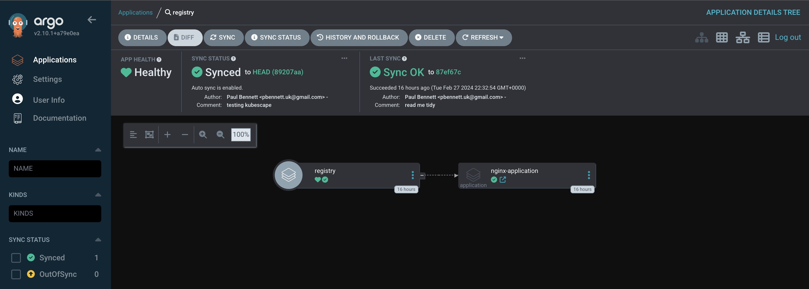

A little background here, at work we use [Flux](https://fluxcd.io/) this has been set up for quite a while way before ArgoCD was released. So liking new and shiny things, I decided to go with [ArgoCD](https://argoproj.github.io/cd/) plus I liked the logo much more.

<!-- truncate -->

I will run through how I have installed Argo on my [K3s](https://k3s.io) cluster. First let's check our requirements

## Installation

**Requirements**

- Installed `kubectl` command-line tool.
- Have a `kubeconfig` file (default location is `~/.kube/config`).
- CoreDNS

### 1. Install ArgoCD

```bash
kubectl create namespace argocd
kubectl apply -n argocd -f https://raw.githubusercontent.com/argoproj/argo-cd/stable/manifests/install.yaml
```

This will create a new namespace, argocd, where Argo CD services and application resources will live.

### 2. Download Argo CD CLI

I found the easiest way to do this was with homebrew, which is available for MacOS & Linux.

```bash
brew install argocd
```

### 3. Access The Argo CD API Server

By default, the Argo CD API server is not exposed to an external IP. To access the API server, we will go with port forwarding. I want to set it up with ingress but that will be another task at a later date. Kubectl port-forwarding can also be used to connect to the API server without exposing the service.

```bash
kubectl port-forward svc/argocd-server -n argocd 8080:443
```

However, I found this was not persistent. When I closed my terminal session this session to the UI died with it. So in this case I enabled port forwarding via [Lens](https://k8slens.dev/) which kept it open. This all should be resolved once I have sorted out the Ingress.

### 4. Login Using The CLI

The initial password for the admin account is auto-generated and stored as clear text in the field password in a secret named argocd-initial-admin-secret in your Argo CD installation namespace. You can simply retrieve this password using the argocd CLI:

```bash
argocd admin initial-password -n argocd
```

Make sure you change the password in the user settings once the UI has booted up. Now we have ArgoCD up and running.

## Apps of Apps setup

With ArgoCD I believe the way most DevOps guys set it up, is to have one repo per project and add those separately. But what happens if you have a mono repo of all your manifests similar to this:

```
k8s-manifests/
├── namespaces
│   ├── production
│   │   └── namespace.yaml
│   └── staging
│       └── namespace.yaml
├── apps
│   ├── app1
│   │   ├── deployment.yaml
│   │   ├── service.yaml
│   │   └── configmap.yaml
│   └── app2
│       ├── deployment.yaml
│       ├── service.yaml
│       └── ingress.yaml
└── db
    ├── postgres
    │   ├── deployment.yaml
    │   ├── service.yaml
    │   └── pvc.yaml
    └── redis
        ├── deployment.yaml
        └── service.yaml
```

We have something similar set up at my place of work, where we have one repo full of manifests with each directory being its own namespace. I wanted to try and replicate that within ArgoCD. Here we are going to use the [apps of apps](https://argo-cd.readthedocs.io/en/stable/operator-manual/cluster-bootstrapping/) pattern. This is where we load one app to control multiple apps.

This all clicked after watching the following video on YT. [The App of Apps Pattern for Argo CD in Less than 8 Minutes](https://youtu.be/2pvGL0zqf9o?si=1YaQfj95GU9L39iS) where Nicholas goes on to explain that Argo CD applications, projects and settings can be defined declaratively using Kubernetes manifests.

[ArgoCD](https://argoproj.github.io/cd/) watches the clusters in my kubernetes folder (see Directories below) and makes the changes to my clusters based on the state of my Git repository. The way ArgoCD works for me here is it will search through `kubernetes/registry...`. Then deploy apps using the apps of apps pattern.

```
📁 kubernetes
├── 📁 apps                        # application directory
│   └── 📁 nginx
│       └── nginx-deployment.yml
├── argo-root.yml
└── 📁 registry                   # registry of applications
    └── nginx.yml
```

My `argo-root.yml` argocd application checks for changes in `kubernetes/registry` for new `Application` manifests. That application then checks in the `apps` directory, and then deploys the app like the below:

```yml
source:
  repoURL: "https://github.com/mrpbennett/home-ops.git"
  path: kubernetes/apps/nginx
```

So lets set this up...

Click the `+ NEW APP` button, and I found the easiest way was to next `EDIT AS YAML` and paste this in:

```yaml
apiVersion: argoproj.io/v1alpha1
kind: Application
metadata:
  name: <app name>
  namespace: argocd
  finalizers:
    - resources-finalizer.argocd.argoproj.io
spec:
  project: default
  source:
    repoURL: "https://github.com/<your repo>.git"
    path: <your path to your apps of apps> # eg: kubernetes/registry
    targetRevision: HEAD
  destination:
    server: "https://kubernetes.default.svc"
  syncPolicy:
    automated:
      prune: true
      selfHeal: true
    syncOptions:
      - Validate=true
      - CreateNamespace=false
    retry:
      limit: 5
      backoff:
        duration: 5s
        maxDuration: 5m0s
        factor: 2
```

Once the above is deploy you will have a app (in my case) called registry and should look something like this:


> What is that `nginx-application` there though?

This is the first application we have deployed via the apps of apps pattern. Our root application `registry` looks in the directory `kubernetes/registry/...` for application deployments.

Each manifest in the `registry` directory would look similar to this:

```yml
apiVersion: argoproj.io/v1alpha1
kind: Application
metadata:
  name: nginx-application
  namespace: argocd
  finalizers:
    - resources-finalizer.argocd.argoproj.io
spec:
  project: default
  source:
    repoURL: "https://github.com/mrpbennett/home-ops.git"
    path: kubernetes/apps/nginx
    targetRevision: HEAD
    directory:
      recurse: true
  destination:
    namespace: nginx-test
    server: "https://kubernetes.default.svc"
  syncPolicy:
    automated:
      prune: true
      selfHeal: true
    syncOptions:
      - CreateNamespace=true
    retry:
      limit: 5
      backoff:
        duration: 5s
        maxDuration: 5m0s
        factor: 2
```

With this `Application` manifest we're telling ArgoCD use `recurse` so Argo can drill down into the directories within my apps directory. Because by default, directory applications will only include the files from the root of the configured repository/path. I found that tip in this video [Introduction to Argo CD : Kubernetes DevOps CI/CD](https://youtu.be/2WSJF7d8dUg?si=tbFRG-aeRYfPqqu_&t=215). We're also `prune` which will remove any dead / unused resources and `selfHeal` where our application enables automatic sync when the live cluster's state deviates from the state defined in Git.

With the above you can see the `Application` is looking inside the `path: kubernetes/apps/nginx` directory. This is where our application manifests are located.

As it's a simple Nginx deployment this is what we have

```yml
apiVersion: apps/v1
kind: Deployment
metadata:
  name: nginx-deployment
spec:
  replicas: 1
  selector:
    matchLabels:
      app: nginx
  template:
    metadata:
      labels:
        app: nginx
    spec:
      containers:
        - name: nginx
          image: nginx:latest
          ports:
            - containerPort: 80

---
apiVersion: v1
kind: Service
metadata:
  name: nginx-loadbalancer
spec:
  type: LoadBalancer
  ports:
    - port: 80
      targetPort: 80
  selector:
    app: nginx
```

Now in ArgoCD you can see it be deployed once commited into the repo



We can see that the registry application has deployed the `Nginx` application, if we head into that application we can see all the pods within that application / namespace.


Now all that is needed to deploy more apps is to create a new Application manifest in the `registry` directory that will point to the applications `apps/appname` directory to deploy the needed manifest files.
