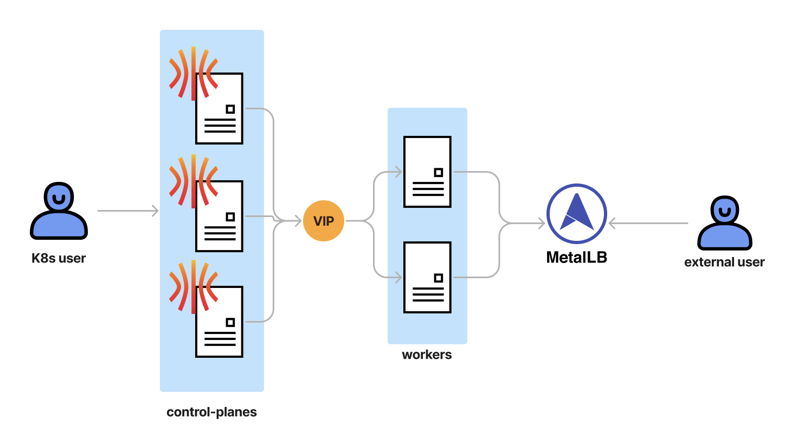

If you deployed your Kubernetes cluster in Cloud, the cloud provider will take care of creating Load balancer instances. But if you are using bare metal for the Kubernetes cluster, you have very limited choices.

<!-- truncate -->

So we're going to set up [MetalLB](https://metallb.universe.tf/ "metalLb") today. MetalLb is a load-balancer implementation for bare metal Kubernetes clusters, using standard routing protocols. It can also be used on VMs, Proxmox is supported you can check support [here](https://metallb.universe.tf/installation/clouds/)

## Installing

To install MetalLB the docs suggest installing by manifests, therefore simply run

```bash
kubectl apply -f https://raw.githubusercontent.com/metallb/metallb/v0.14.3/config/manifests/metallb-native.yaml
```

To apply the manifests to your cluster. This will deploy MetalLB to your cluster, under the `metallb-system` namespace. The components in the manifest are:

- The `metallb-system/controller` deployment. This is the cluster-wide controller that handles IP address assignments.
- The `metallb-system/speaker` daemonset. This is the component that speaks the protocol(s) of your choice to make the services reachable.
- Service accounts for the controller and speaker, along with the RBAC permissions that the components need to function.

The installation manifest does not include a configuration file. MetalLB’s components will still start, but will remain idle until you start deploying resources.

## Defining The IPs To Assign To The Load Balancer Services

Let's now deploy those resources.

In order to assign an IP to the services, MetalLB must be instructed to do so via the `IPAddressPool` CR.

All the IPs allocated via `IPAddressPools` contribute to the pool of IPs that MetalLB uses to assign IPs to services.

Layer 2 mode is the simplest to configure: in many cases, you don’t need any protocol-specific configuration, only IP addresses.

Layer 2 mode does not require the IPs to be bound to the network interfaces of your worker nodes. It works by responding to ARP requests on your local network directly, to give the machine’s MAC address to clients.

In order to advertise the IP coming from an `IPAddressPool`, an L2Advertisement instance must be associated to the `IPAddressPool`.

For example, the following configuration gives MetalLB control over IPs from `192.168.1.240` to `192.168.1.240`, and configures Layer 2 mode:

```yml
apiVersion: metallb.io/v1beta1
kind: IPAddressPool
metadata:
  name: first-pool
  namespace: metallb-system
spec:
  addresses:
    - 192.168.1.240-192.168.1.240
```

If there is no `IPAddressPool` selector in an `L2Advertisement` instance is interpreted as that instance being associated to all the `IPAddressPools` available. We can change that by adding a `L2Advertisement` manifest that points to our `IPAddressPool` in this case it's called `first-pool`

```yaml
apiVersion: metallb.io/v1beta1
kind: L2Advertisement
metadata:
  name: talos-l2
  namespace: metallb-system
spec:
  ipAddressPools:
    - first-pool
```

Deploy those 3 manifests and you're good. You know have a load-balancer implementation for bare metal / VM.

Now MetalLB is installed and configured, to expose a service externally, simply create it with `spec.type` set to `LoadBalancer`, and MetalLB will do the rest.


