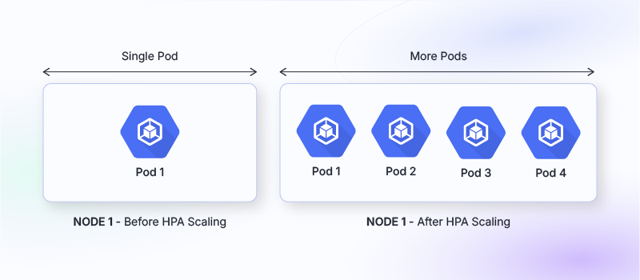
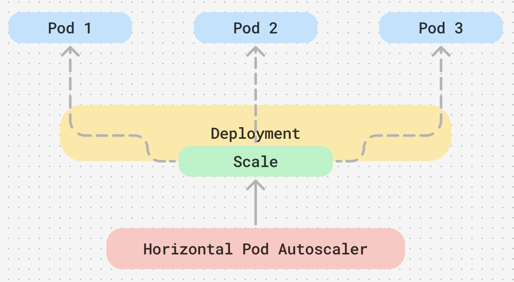
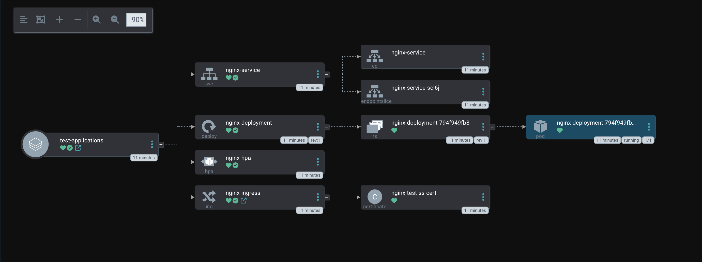
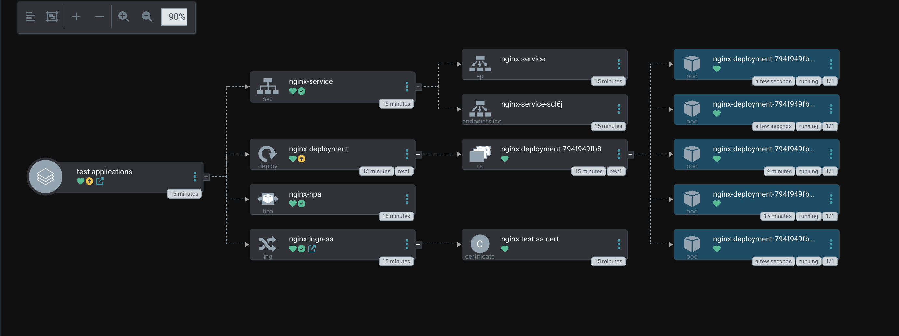

Today I have set up HorizontalPodAutoscaler (HPA) on a basic level. What is HorizontalPodAutoscaler you ask! Well, HorizontalPodAutoscaler allows your application to well, scale...horizontally. HPA adjusts the number of pods running your app to match how much work needs to be done. In the words of ChatGPT here is the ELI5 version:

<!-- truncate -->

> Imagine you have a lemonade stand, and on a hot day, a lot of people come to buy lemonade. If you're working alone, you might get overwhelmed. So, you decide to call your friends to help when the line gets too long. When it gets less busy, your friends go back home.
>
> A HorizontalPodAutoscaler (HPA) in Kubernetes works like that. It watches your application (like the lemonade stand) and sees how "busy" it is — for example, by checking how much CPU or memory it's using. If things get too busy, it automatically adds more helpers (called "pods") to handle the extra work. When things slow down, it reduces the number of helpers to save resources.

Horizontal scaling means that the response to increased load is to deploy more Pods. This is different from vertical scaling, which for Kubernetes would mean assigning more resources (for example: memory or CPU) to the Pods that are already running for the workload.



Kubernetes implements horizontal pod autoscaling as a control loop that runs intermittently (it is not a continuous process). The interval is set by the `--horizontal-pod-autoscaler-sync-period` parameter to the [`kube-controller-manager`](https://kubernetes.io/docs/reference/command-line-tools-reference/kube-controller-manager/) (and the default interval is 15 seconds).

Once during each period, the controller manager queries the resource utilization against the metrics specified in each `HorizontalPodAutoscaler` definition. The controller manager finds the target resource defined by the `scaleTargetRef`, then selects the pods based on the target resource's `.spec.selector` labels, and obtains the metrics from either the resource metrics API (for per-pod resource metrics), or the custom metrics API (for all other metrics).

With the introduction to v2 of the `autoscaling` API this allows for any HPA target can be scaled based on the resource usage of the pods in the scaling target. When defining the pod specification the resource requests like CPU and memory should be specified. Therefore if you're application is CPU resource intensive you can use `resource.name: cpu` or if it's memory heavy use `resource.name: memory` then the HPA will scale the target up or down depending on resource utilisation based scaling specify a metric source like this:

```yaml
type: Resource
resource:
  name: cpu
  target:
    type: Utilization
    averageUtilization: 60
```

The HPA controller will keep the average utilization of the pods in the scaling target at 60%. Utilization is the ratio between the current usage of resources to the requested resources of the pod.

## Deploying the application

To get started I went ahead and deployed a simple nginx application, this application only has the one replica. I am hoping the HPA will scale this up when I overload it. Within the file is also a simple service that exposes the nginx app via a `LoadBalancer`. This will only work if you're running something like [MetalLB](https://metallb.universe.tf) or [KubeVIP](https://kube-vip.io/docs/usage/kubernetes-services/).

For the HPA to actually work `spec.spec.resources` will need to be defined. You will also need some sort of metrics to be used. In my cluster, I have set up [`kube-prometheus-stack`](https://github.com/prometheus-community/helm-charts/tree/main/charts/kube-prometheus-stack)

```yaml
apiVersion: apps/v1
kind: Deployment
metadata:
  name: nginx-deployment
spec:
  replicas: 1
  selector:
    matchLabels:
      app: nginx
  template:
    metadata:
      labels:
        app: nginx
    spec:
      containers:
 - name: nginx
          image: nginx
          ports:
 - containerPort: 80
          resources:
            requests:
              cpu: '100m'
              memory: '128Mi'
            limits:
              cpu: '200m'
              memory: '256Mi'
---
apiVersion: v1
kind: Service
metadata:
  name: nginx-service
spec:
  selector:
    app: nginx
  ports:
 - protocol: TCP
      port: 80
      targetPort: 80
  type: LoadBalancer
```

Once the application has been deployed we can check that it's running.

```bash
kubectl get pods -n nginx

NAME                                READY   STATUS    RESTARTS   AGE
nginx-deployment-794f949fb8-zgl4l   1/1     Running   0          10m
```

Now that the pod is up and running. The HPA can be created in the example below will scale on CPU usage, the HPA will scale when the pod uses more than 20% of its CPU and scale up to 5 pods.

```yaml
apiVersion: autoscaling/v2
kind: HorizontalPodAutoscaler
metadata:
  name: nginx-hpa
spec:
  scaleTargetRef:
    apiVersion: apps/v1
    kind: Deployment
    name: nginx-deployment
  minReplicas: 1
  maxReplicas: 5
  metrics:
 - type: Resource
      resource:
        name: cpu
        target:
          type: Utilization
          averageUtilization: 20
```

Now deploy the HPA.

```bash
kubectl apply -f hpa.yaml
```

Once deployed, check that it's running and describe to see the events. As this has just been deployed there are no events currently which is expected as the application hasn't had any excessive load.

```bash
kubectl get hpa -n nginx
NAME        REFERENCE                     TARGETS       MINPODS   MAXPODS   REPLICAS   AGE
nginx-hpa   Deployment/nginx-deployment   cpu: 0%/40%   1         5         1          3m44s

kubectl describe hpa nginx-hpa -n nginx
Name:                                                  nginx-hpa
Namespace:                                             test-applications
Labels:                                                app.kubernetes.io/instance=test-applications
Annotations:                                           <none>
CreationTimestamp:                                     Thu, 21 Nov 2024 10:36:28 +0000
Reference:                                             Deployment/nginx-deployment
Metrics:                                               ( current / target )
 resource cpu on pods (as a percentage of request):  0% (0) / 40%
Min replicas:                                          1
Max replicas:                                          5
Deployment pods:                                       1 current / 1 desired
Conditions:
 Type            Status  Reason               Message
 ----            ------  ------               -------
 AbleToScale     True    ScaleDownStabilized  recent recommendations were higher than current one, applying the highest recent recommendation
 ScalingActive   True    ValidMetricFound     the HPA was able to successfully calculate a replica count from cpu resource utilization (percentage of request)
 ScalingLimited  False   DesiredWithinRange   the desired count is within the acceptable range
Events:           <none>
```

## Testing it out

Everything has been deployed and is in a state where the HPA isn't needed. It's time to see how the autoscaler reacts to increased load. To do this, I'll be using [hey](https://github.com/rakyll/hey) to run this install via Homebrew `brew install hey`

Because the nginx service has been exposed by a `LoadBalancer` it allows the use of the external IP.

```bash
kubectl get svc -n nginx

NAME            TYPE           CLUSTER-IP     EXTERNAL-IP    PORT(S)        AGE
nginx-service   LoadBalancer   10.102.26.86   192.168.5.54   80:30141/TCP   10m
```

With the application being in its standard state we can see the single pod in ArgoCD



With hey installed its time to test the application scaling, run the following:

```bash
hey -n 10000 -c 100 http://192.168.5.54
```

- `-n 100000`: Total number of requests to send.
- `-c 1000`: Number of concurrent requests.

This command generates sufficient load to increase CPU usage and triggers scaling.

After running the above now run, give it a few minutes before things start to change:

```bash
kubectl get hpa nginx-hpa -n nginx --watch
```

Then in a separate terminal run the following to see the pods scale up:

```bash
kubectl get deployment -l app=nginx -w
```

After a few we can see that hey increased the CPU usage to 169% which then started to reduce.

```bash
NAME        REFERENCE                     TARGETS       MINPODS   MAXPODS   REPLICAS   AGE
nginx-hpa   Deployment/nginx-deployment   cpu: 0%/20%   1         5         2          13m
nginx-hpa   Deployment/nginx-deployment   cpu: 169%/20%   1         5         2          14m
nginx-hpa   Deployment/nginx-deployment   cpu: 72%/20%    1         5         4          14m
nginx-hpa   Deployment/nginx-deployment   cpu: 0%/20%     1         5         5          14m
```

After a while the pods will have increased to their maximum to allow for the increase resource consumption.

```bash
NAME               READY   UP-TO-DATE   AVAILABLE   AGE
nginx-deployment   5/5     5            5           14m
```

Looking back at ArgoCD the 5 pods are there.



Once the load has decreased on the application, the pods will scale down back to normal...And that's it! A very handy tool to prevent your application from slowing down or breaking all together.
