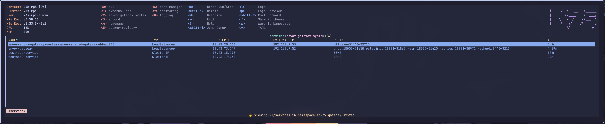
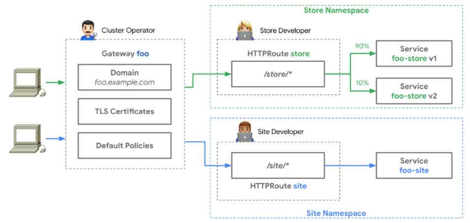

--- 
title: Gateway API migration
slug: gatewayapi-migration-from-ingress-nginx
tags: [kubernetes]
keywords:
  - GatewayAPI
  - Kubernetes
  - Ingress
last_updated:
  date: 2025-11-13
---

As of now Ingress NGINX is being retired, sad times all around. As per the blog post [Ingress NGINX Retirement: What You Need to Know](https://kubernetes.io/blog/2025/11/11/ingress-nginx-retirement/) it mentions:

> Existing deployments of Ingress NGINX will continue to function and installation artifacts will remain available.

But where would the fun be in that? Although I can tell you now, I should have left my setup the way it is... but nope, this is me migrating to the Gateway API. So let's get started!

<!-- truncate -->

## Why Gateway API?

Before diving into the migration, let's understand why Gateway API is a significant improvement over traditional Ingress resources:

### Benefits of Gateway API

1. **Better Separation of Concerns**: Gateway API separates infrastructure concerns (handled by platform teams) from application routing (handled by development teams). This is achieved through different resource types like `Gateway` and `HTTPRoute`.

2. **More Expressive Routing**: Unlike Ingress which has basic path and host-based routing, Gateway API supports advanced features like:
   - Header-based routing
   - Query parameter matching
   - Weighted traffic splitting
   - Method-based routing

3. **Standardized Across Controllers**: Gateway API provides a consistent interface across different ingress controllers (Envoy, NGINX, Istio, etc.), reducing vendor lock-in.

4. **Enhanced Multi-tenancy**: Clear role-based access control with different resources for different personas in the organization.

5. **Built-in Extensibility**: Designed with extension points for custom functionality without breaking the core API.

### Ingress vs Gateway API Comparison

| Feature | Ingress | Gateway API |
|---------|---------|-------------|
| **API Maturity** | Stable (v1) | Stable for core features (v1) |
| **Routing Capabilities** | Basic (host/path) | Advanced (headers, methods, weights) |
| **Role Separation** | Single resource | Multiple resources (Gateway, HTTPRoute) |
| **Protocol Support** | HTTP/HTTPS only | HTTP/HTTPS, TCP, UDP, gRPC |
| **Traffic Splitting** | Controller-specific annotations | Native support |
| **Cross-namespace Routing** | Limited | Built-in with proper RBAC |
| **Vendor Portability** | Controller-specific features | Standardized API |
| **TLS Configuration** | Basic | Advanced (SNI, multiple certs) |
| **Backend Configuration** | Limited | Rich (retries, timeouts, load balancing) |

## Getting started with the Gateway API

For the migration I picked [Envoy Gateway](https://gateway.envoyproxy.io/) as the documentation seemed to be the best, and the application seems to be well liked within the Kubernetes community so let's get cracking. I'm going to deploy this with an apps of apps pattern using ArgoCD, which allows me to deploy more manifests than just the Helm chart, enabling more modular deployments.

###  The App entry point

First I went ahead and created the application's entry point. This is picked up by my registry app which populates all other apps.

```yaml
apiVersion: argoproj.io/v1alpha1
kind: Application
metadata:
  name: envoy-gateway
  namespace: argocd
  annotations:
    argocd.argoproj.io/sync-wave: '0'
  finalizers:
    - resources-finalizer.argocd.argoproj.io
spec:
  project: default
  source:
    repoURL: 'https://github.com/mrpbennett/home-ops.git'
    path: kubernetes/apps/envoy-gateway # this points to the directory where the manifests are stored.
    targetRevision: HEAD
    directory:
      recurse: true
  destination:
    namespace: envoy-gateway-system
    server: 'https://kubernetes.default.svc'
  syncPolicy:
    automated:
      prune: true
      selfHeal: true
    syncOptions:
      - CreateNamespace=true
    retry:
      limit: 5
      backoff:
        duration: 5s
        maxDuration: 5m0s
        factor: 2
```

### App directory structure 

Next, the applications directory needs to be created. I went with the following setup:

```bash
📁 envoy-gateway 
├── 📁 helm-chart
│   └── envoy-gateway-helm.yaml
└── 📁 resources
    ├── gateway-class.yaml
    ├── https-gateway.yaml
    └── wildcard-certificate.yaml
```

### Deploying the Helm chart

If you read the [quick guide](https://gateway.envoyproxy.io/docs/tasks/quickstart/), it suggests you install via Helm. I headed over to the Install section instead and read through [https://gateway.envoyproxy.io/docs/install/install-argocd/](https://gateway.envoyproxy.io/docs/install/install-argocd/) where it gives you a basic manifest.

Here mine is slightly tweaked. I added some of the default Helm [chart values](https://gateway.envoyproxy.io/docs/install/gateway-helm-api/) just because I wanted to see them in case I wanted to make a change. I also changed the service type to `LoadBalancer` as I am using bare-metal and [MetalLb](https://metallb.io/).

```yaml
apiVersion: argoproj.io/v1alpha1
kind: Application
metadata:
  name: envoy-gateway-helm
  namespace: argocd
spec:
  project: default
  source:
    helm:
      valuesObject:
        deployment:
          annotations: {}
          envoyGateway:
            resources:
              limits:
                memory: 1024Mi
              requests:
                cpu: 100m
                memory: 256Mi

        # Set type: to LB so it can talk with MetalLb
        service:
          trafficDistribution: ''
          annotations: {}
          type: LoadBalancer

        config:
          # -- EnvoyGateway configuration. Visit https://gateway.envoyproxy.io/docs/api/extension_types/#envoygateway to view all options.
          envoyGateway:
            gateway:
              controllerName: gateway.envoyproxy.io/gatewayclass-controller
            provider:
              type: Kubernetes
            logging:
              level:
                default: info
            extensionApis: {}

        createNamespace: false
        kubernetesClusterDomain: cluster.local

    chart: gateway-helm
    path: gateway-helm
    repoURL: docker.io/envoyproxy
    targetRevision: v1.6.0

  destination:
    namespace: envoy-gateway-system
    server: https://kubernetes.default.svc

  syncPolicy:
    syncOptions:
      - CreateNamespace=true
      - ServerSideApply=true
    automated:
      prune: true
      selfHeal: true
```
:::note
Set `ServerSideApply` to true to enable Kubernetes server-side apply. This helps avoid the 262,144-byte annotation size limit.
:::

#### Validation Steps

After deploying the Helm chart, verify the Envoy Gateway installation:

```bash
# Check if the Envoy Gateway pods are running
kubectl get pods -n envoy-gateway-system

# Verify the GatewayClass is available
kubectl get gatewayclass

# Check Envoy Gateway controller logs
kubectl logs -n envoy-gateway-system deployment/envoy-gateway -f
```

Expected output should show the `envoy-gateway` pod in `Running` state and the controller logs should indicate successful startup.

### Adding extra resources

Below are the extra manifests I deployed alongside my Helm chart. Here, I am creating a `GatewayClass`, `Gateway` and `Certificate`. Instead of using annotations on the Gateway (which can cause conflicts), I created an explicit `Certificate` resource, which is then handled by cert-manager.

```yaml
apiVersion: gateway.networking.k8s.io/v1
kind: GatewayClass
metadata:
  name: envoy-gatewayclass
spec:
  controllerName: gateway.envoyproxy.io/gatewayclass-controller
---
apiVersion: gateway.networking.k8s.io/v1
kind: Gateway
metadata:
  name: envoy-shared-gateway
spec:
  gatewayClassName: envoy-gatewayclass
  listeners:
    - name: https
      protocol: HTTPS
      port: 443
      hostname: '*.70ld.dev'
      tls:
        mode: Terminate
        certificateRefs:
          - kind: Secret
            name: wildcard-70ld-tls
---
apiVersion: cert-manager.io/v1
kind: Certificate
metadata:
  name: wildcard-70ld-certificate
  namespace: envoy-gateway-system
spec:
  secretName: wildcard-70ld-tls
  issuerRef:
    name: letsencrypt-cloudflare-dns-issuer
    kind: ClusterIssuer
  dnsNames:
    - '*.70ld.dev'
    - '70ld.dev'
```
With the Gateway, the key points about this configuration are:
- Uses `Terminate` mode for TLS termination at the gateway
- References the Secret created by cert-manager
- Restricts to our domain with the `hostname` field

Now this can be committed and ArgoCD will deploy the manifests for me. Let's check some things before moving forward.

#### Validation Steps

```bash
# Verify the GatewayClass is accepted
kubectl get gatewayclass envoy-gatewayclass
# Status should show ACCEPTED=True

# Check Gateway status
kubectl get gateway envoy-shared-gateway -n envoy-gateway-system
# Status should show READY=True

# Verify the certificate is ready
kubectl get certificate wildcard-70ld-certificate -n envoy-gateway-system
# Status should show READY=True

# Check the LoadBalancer service
kubectl get svc -n envoy-gateway-system
```



Here we can see that the `LoadBalancer` service was given the external IP `191.168.7.53` for our service. This will allow us to create DNS records. ✅

## Setting up Cert Manager

I currently have cert manager setup via manifests, but after reading [https://cert-manager.io/docs/usage/gateway/](https://cert-manager.io/docs/usage/gateway/), it seems the better way to install it would be via Helm. The reason for Helm is because, for me, it's easier to see what I am changing. I'll show this below.

Cert-manager can generate TLS certificates for Gateway resources. This is configured by adding annotations to a Gateway and is similar to the process for Securing Ingress Resources.

The Gateway resource holds the TLS configuration, as illustrated in the following diagram (source: https://gateway-api.sigs.k8s.io):



Since we have applied the Gateway controller and Gateway Class above, we can install Cert Manager via Helm. Since I am using ArgoCD, this is how I would deploy it. Doing it this way allows us to enable the GatewayAPI by setting some values. As well as providing some extra manifests, for example below I have a `ClusterIssuer` and the `Secret` for my Cloudflare API key:

```yaml
apiVersion: argoproj.io/v1alpha1
kind: Application
metadata:
  name: cert-manager
  namespace: argocd
spec:
  project: default
  sources:
    - chart: cert-manager
      repoURL: oci://quay.io/jetstack/charts/cert-manager
      targetRevision: 1.19.1
      helm:
        valuesObject:
          crds:
            enabled: true

          config:
            apiVersion: controller.config.cert-manager.io/v1alpha1
            kind: ControllerConfiguration
            enableGatewayAPI: true

          extraObjects:
            - |
              apiVersion: v1
              kind: Secret
              metadata:
                name: cloudflare-api-token-secret
                namespace: cert-manager
              type: Opaque
              data:
                api-token: ZGgxxx

            - |
              apiVersion: cert-manager.io/v1
              kind: ClusterIssuer
              metadata:
                name: letsencrypt-cloudflare-dns-issuer
              spec:
                acme:
                  server: https://acme-v02.api.letsencrypt.org/directory
                  email: p@mrpbennett.dev
                  privateKeySecretRef:
                    name: letsencrypt-cloudflare-dns-issuer-secret
                  solvers:
                    - dns01:
                        cloudflare:
                          apiTokenSecretRef:
                            name: cloudflare-api-token-secret
                            key: api-token

  destination:
    server: https://kubernetes.default.svc
    namespace: cert-manager

  syncPolicy:
    automated:
      prune: true
      selfHeal: true
    syncOptions:
      - CreateNamespace=true
```

#### Validation Steps

After deploying cert-manager, verify the installation:

```bash
# Check cert-manager pods are running
kubectl get pods -n cert-manager

# Verify the ClusterIssuer is ready
kubectl get clusterissuer letsencrypt-cloudflare-dns-issuer
# Status should show READY=True

# Check cert-manager logs
kubectl logs -n cert-manager deployment/cert-manager -f

# Verify Gateway API support is enabled
kubectl logs -n cert-manager deployment/cert-manager | grep -i gateway
```

## External DNS

Next I had to make sure External DNS worked with the new Gateway implementation. This was pretty simple - just a few changes were needed here. I installed External DNS to be used with [Pi-hole](https://pi-hole.net/). The tutorial can be found [here](https://kubernetes-sigs.github.io/external-dns/v0.15.0/docs/tutorials/pihole/#externaldns-manifest). This worked well with my Ingress setup, but I needed to make some changes to the `deployment` and the `clusterrole`. Those changes are as follows:

```yaml
apiVersion: rbac.authorization.k8s.io/v1
kind: ClusterRole
metadata:
  name: external-dns
rules:
- apiGroups: [""]
  resources: ["services","endpoints","pods"]
  verbs: ["get","watch","list"]
  
- apiGroups: ["extensions","networking.k8s.io"]
  resources: ["ingresses"]
  verbs: ["get","watch","list"]
  
- apiGroups: [""]
  resources: ["nodes"]
  verbs: ["list","watch"]
  
 ## add the following:
- apiGroups: ['gateway.networking.k8s.io']
  resources: ['gateways', 'httproutes', 'tlsroutes', 'tcproutes', 'udproutes']
  verbs: ['get', 'watch', 'list']
  
- apiGroups: ['discovery.k8s.io']
  resources: ['endpointslices']
  verbs: ['get', 'watch', 'list']
  
- apiGroups: ['']
  resources: ['namespaces']
  verbs: ['get', 'list', 'watch']
```
Then add the following flag to the `args:` within the deployment: `--source=gateway-httproute` so it can check Gateway HTTP route sources. With the following changes, this should generate a DNS record within Pi-hole.

#### Validation Steps

Verify External DNS is working with Gateway API:

```bash
# Check External DNS pods
kubectl get pods -n external-dns

# View External DNS logs to see if it's picking up Gateway resources
kubectl logs -n external-dns deployment/external-dns -f

# Verify it can see the Gateway
kubectl logs -n external-dns deployment/external-dns | grep -i gateway
```

## Hooking it all up

Everything should be deployed and set up correctly to accept some HTTP routes. Here is a test deployment to check that everything is working fine.

```yaml
apiVersion: apps/v1
kind: Deployment
metadata:
  name: testapp2
  namespace: envoy-gateway-system
  labels:
    app: testapp2
spec:
  replicas: 1
  selector:
    matchLabels:
      app: testapp2
  template:
    metadata:
      labels:
        app: testapp2
    spec:
      containers:
        - name: nginx
          image: nginx:alpine
          ports:
            - containerPort: 80
          resources:
            requests:
              cpu: 10m
              memory: 16Mi
            limits:
              cpu: 100m
              memory: 128Mi
---
apiVersion: v1
kind: Service
metadata:
  name: testapp2-service
  namespace: envoy-gateway-system
  labels:
    app: testapp2
spec:
  selector:
    app: testapp2
  ports:
    - port: 80
      targetPort: 80
      protocol: TCP
  type: ClusterIP
---
apiVersion: gateway.networking.k8s.io/v1
kind: HTTPRoute
metadata:
  name: testapp2-route
  namespace: envoy-gateway-system
spec:
  parentRefs:
    - name: envoy-shared-gateway
      namespace: envoy-gateway-system
  hostnames:
    - 'test-new.70ld.dev'
  rules:
    - matches:
        - path:
            type: PathPrefix
            value: /
      backendRefs:
        - name: testapp2-service
          port: 80
```
#### Validation Steps

Before checking Pi-hole, let's validate the HTTPRoute deployment:

```bash
# Check if the test deployment is running
kubectl get deployment testapp2 -n envoy-gateway-system

# Verify the service is accessible
kubectl get svc testapp2-service -n envoy-gateway-system

# Check HTTPRoute status
kubectl get httproute testapp2-route -n envoy-gateway-system
# Status should show ACCEPTED=True

# Describe HTTPRoute for detailed status
kubectl describe httproute testapp2-route -n envoy-gateway-system

# Test internal connectivity (from within cluster)
kubectl run test-pod --image=curlimages/curl -i --tty --rm -- curl -k https://test-new.70ld.dev
```

Once the test application has been deployed, it's time to head over to my Pi-hole instance to check if the DNS record has populated. BOOM! It worked...


Awesome! This is good news - we can see it's pointing to the IP address of the `LoadBalancer` service. The IP address was handed out from a pool given to MetalLB.

Now let's check if the site actually loads...


Beautiful! It loads and we're getting HTTPS with no certificate warnings.

#### Final Validation

To ensure everything is working correctly:

```bash
# Test the complete flow
curl -v https://test-new.70ld.dev

# Check certificate details
openssl s_client -connect test-new.70ld.dev:443 -servername test-new.70ld.dev < /dev/null 2>/dev/null | openssl x509 -text -noout | grep -A2 "Subject:"

# Verify DNS resolution
nslookup test-new.70ld.dev

# Check Gateway metrics (if available)
kubectl port-forward -n envoy-gateway-system svc/envoy-gateway-metrics-service 19001:19001
# Then visit http://localhost:19001/stats in your browser
```

The migration is now complete! 🎉


## Lessons Learned 💡

### What Went Wrong
- **Complexity**: Gateway API has more moving parts than Ingress
- **Learning Curve**: New concepts like parentRefs and listeners took time
- **Migration Effort**: Converting all existing applications was time-consuming

### What I'd Do Differently
- **Gradual Migration**: Run both systems in parallel longer
- **Better Planning**: Map out all existing Ingress resources first
- **Testing Strategy**: Set up comprehensive testing before switching

### Performance Considerations
- **Resource Usage**: Envoy Gateway uses ~200MB more memory than NGINX Ingress
- **Startup Time**: Takes longer to initialize but performs similarly once running

## Conclusion

Migrating from Ingress NGINX to Gateway API using Envoy Gateway was a significant undertaking, but the benefits are clear:

- **Better separation of concerns** between platform and application teams
- **More expressive routing capabilities** for complex traffic patterns  
- **Standardized API** that works across different ingress controllers
- **Future-proof architecture** aligned with Kubernetes evolution

While the migration required effort and had its challenges, the Gateway API provides a more robust foundation for modern Kubernetes networking. The investment in learning and migrating pays off with increased flexibility and maintainability.

**Key Takeaways:**
- Plan your migration carefully and test thoroughly
- Use explicit Certificate resources instead of annotations
- Validate each step before proceeding
- Keep both systems running during transition

The future of Kubernetes ingress is bright with Gateway API! 🚀
