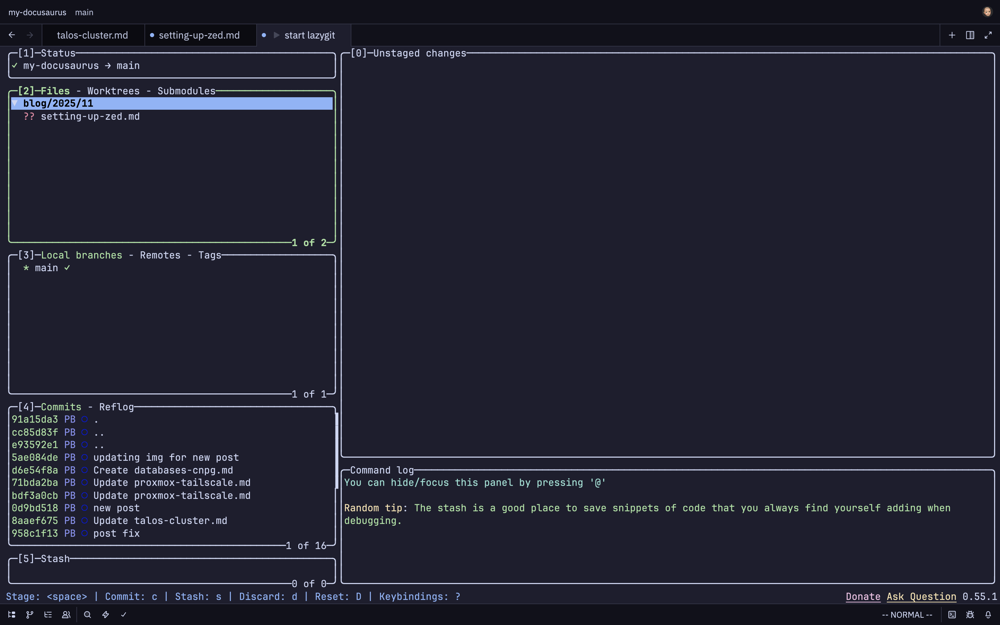
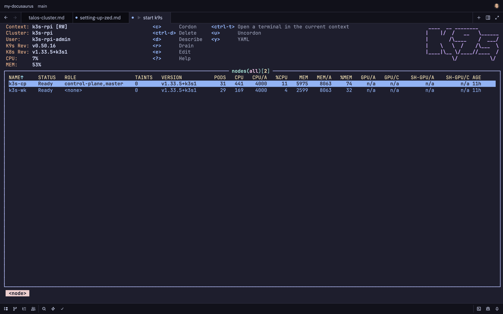

I love trying out new text editors, don't ask me why because when I get used to one, something new comes out that I want to try—that's just the way it goes, I guess.

This time I am trying out [Zed](https://zed.dev) "The editor for what's next" written in Rust.

> Zed is a next-generation code editor designed for high-performance collaboration with humans and AI.

<!--truncate-->

I must admit it's pretty sweet. But not as sweet as [LazyVim](https://lazyvim.org) which is currently my daily driver. So coming from LazyVim, I wanted to get Zed close to my LazyVim experience, allowing me to get up to speed quicker than I would otherwise. Similar to LazyVim, Zed is managed by a bunch of `dotfiles`.

Here are my dotfiles for my Zed setup. I mainly write in Python, Go, and YAML. Being a homelabber, I spend a lot of time in Docker and Kubernetes manifests. Setting up YAML is important to me; currently with this setup I have yet to get Kubernetes completion sorted, but that is a task for another day.

Python and Go work well though—Go is simply awesome in terms of getting editors set up.

## settings.json

```json
// settings.json
{
  "agent": {
    "always_allow_tool_actions": true,
    "default_model": {
      "provider": "copilot_chat",
      "model": "claude-sonnet-4"
    },
    "model_parameters": []
  },
  "diagnostics": {
    "inline": {
      "enabled": true
    }
  },
  "inlay_hints": {
    "enabled": true
  },
  "buffer_font_family": "JetBrainsMono Nerd Font Mono",
  "ui_font_family": ".ZedSans",
  "icon_theme": "Catppuccin Mocha",
  "vim_mode": true,
  "cursor_blink": false,
  "relative_line_numbers": true,
  "scroll_beyond_last_line": "off",
  "scrollbar": { "show": "never" },
  "ui_font_size": 16.0,
  "buffer_font_size": 14.0,
  "theme": {
    "mode": "system",
    "light": "One Light",
    "dark": "Catppuccin Mocha (blue)"
  },
  // Indentation, rainbow indentation
  "indent_guides": {
    "enabled": true,
    "coloring": "indent_aware"
  },
  "languages": {
    "Python": {
      "language_servers": ["ruff", "basedpyright", "!pyright"],
      "formatter": [
        { "code_action": "source.organizeImports.ruff" },
        { "code_action": "source.fixAll.ruff" },
        {
          "language_server": {
            "name": "ruff"
          }
        }
      ]
    }
  },
  "lsp": {
    "basedpyright": {
      "settings": {
        "basedpyright.analysis": {
          "diagnosticMode": "workspace",
          "inlayHints": {
            "callArgumentNames": false
          }
        }
      }
    },
    "gopls": {
      "initialization_options": {
        "gofumpt": true
      }
    },
    "yaml-language-server": {
      "settings": {
        "yaml": {
          // "keyOrdering": true,
          "completion": true,
          "format": {
            "enabled": true,
            "singleQuote": true
          },
          "schemaStore": { "enable": true },
          "schemas": {
            "kubernetes": "**/*.yaml"
          },
          "editor": { "tabSize": 4 }
        }
      }
    }
  }
}
```

## Keymappings

After doing some googling, I came across this [awesome post](https://www.reddit.com/r/ZedEditor/comments/1jvo98k/zed_with_lazyvim_keymaps_my_perfect_editor_setup/) where [xheisenbugx](https://www.reddit.com/user/xheisenbugx/) had created keymappings similar to those of LazyVim for his Zed setup. The below is 99.9% from that post—I have adjusted it slightly for my needs, but these work really well.

```json
// keymaps.json
[
  // Terminal
  {
    "context": "Workspace",
    "bindings": {
      "space f t": "workspace::ToggleBottomDock"
    }
  },
  // Window's navigation
  {
    "context": "Dock || Terminal || Editor",
    "bindings": {
      // Window's motions
      "ctrl-h": "workspace::ActivatePaneLeft",
      "ctrl-l": "workspace::ActivatePaneRight",
      "ctrl-k": "workspace::ActivatePaneUp",
      "ctrl-j": "workspace::ActivatePaneDown"
    }
  },
  {
    "context": "GitPanel",
    "bindings": {
      "q": "git_panel::Close"
    }
  },
  {
    "context": "AgentPanel",
    "bindings": {
      "ctrl-\\": "workspace::ToggleRightDock",
      "cmd-k": "workspace::ToggleRightDock"
    }
  },
  // File panel (netrw)
  {
    "context": "ProjectPanel && not_editing",
    "bindings": {
      "a": "project_panel::NewFile",
      "A": "project_panel::NewDirectory",
      "r": "project_panel::Rename",
      "d": "project_panel::Delete",
      "x": "project_panel::Cut",
      "c": "project_panel::Copy",
      "p": "project_panel::Paste",
      // Close project panel as project file panel on the right
      "q": "workspace::ToggleLeftDock",
      "space e": "workspace::ToggleLeftDock",
      ":": "command_palette::Toggle",
      "%": "project_panel::NewFile",
      "/": "project_panel::NewSearchInDirectory",
      "enter": "project_panel::OpenPermanent",
      "escape": "project_panel::ToggleFocus",
      "h": "project_panel::CollapseSelectedEntry",
      "j": "menu::SelectNext",
      "k": "menu::SelectPrevious",
      "l": "project_panel::ExpandSelectedEntry",
      "o": "project_panel::OpenPermanent",
      "shift-d": "project_panel::Delete",
      "shift-r": "project_panel::Rename",
      "t": "project_panel::OpenPermanent",
      "v": "project_panel::OpenPermanent",
      "shift-g": "menu::SelectLast",
      "g g": "menu::SelectFirst",
      "-": "project_panel::SelectParent",
      "ctrl-6": "pane::AlternateFile"
    }
  },
  // Empty pane, set of keybindings that are available when there is no active editor
  {
    "context": "EmptyPane || SharedScreen",
    "bindings": {
      // Open file finder
      "space space": "file_finder::Toggle",
      // New file
      "space f n": "workspace::NewFile",
      // Open recent project
      "space f p": "projects::OpenRecent",
      // Search in all the files
      "space s g": "workspace::NewSearch",
      // Quit zed
      "space q q": "zed::Quit"
    }
  },
  {
    "context": "Workspace",
    "bindings": {
      "space g g": [
        "task::Spawn",
        { "task_name": "start lazygit", "reveal_target": "center" }
      ]
    }
  },
  {
    "context": "Workspace",
    "bindings": {
      "space k 8": [
        "task::Spawn",
        { "task_name": "start k9s", "reveal_target": "center" }
      ]
    }
  },
  {
    "context": "Editor && VimControl && !VimWaiting && !menu",
    "bindings": {
      // Refactoring
      "space c r ": "editor::Rename",
      // Chat with AI
      "space a a": "assistant::ToggleFocus",
      "ctrl-\\": "workspace::ToggleRightDock",
      "cmd-k": "workspace::ToggleRightDock",
      "space a e": "assistant::InlineAssist",
      "cmd-l": "assistant::InlineAssist",
      "space a t": "workspace::ToggleRightDock",
      "space g h d": "editor::ExpandAllDiffHunks",
      "space g h D": "git::Diff",
      "space g h r": "git::Restore",
      "space g h R": "git::RestoreFile",
      // Toggle inlay hints
      "space u i": "editor::ToggleInlayHints",
      // Toggle soft wrap
      "space u w": "editor::ToggleSoftWrap",
      // Open markdown preview
      "space m p": "markdown::OpenPreview",
      "space m P": "markdown::OpenPreviewToTheSide",
      // Open recent project
      "space f p": "projects::OpenRecent",
      // Search word under cursor in current pane
      "space s w": "buffer_search::Deploy",
      // Search word under cursor in all panes
      "space s W": "pane::DeploySearch",
      // Tab things. Almost as good as harpoon.
      "space 1": ["pane::ActivateItem", 0],
      "space 2": ["pane::ActivateItem", 1],
      "space 3": ["pane::ActivateItem", 2],
      "space 4": ["pane::ActivateItem", 3],
      "space 5": ["pane::ActivateItem", 4],
      "space 6": ["pane::ActivateItem", 5],
      "space 7": ["pane::ActivateItem", 6],
      "space 8": ["pane::ActivateItem", 7],
      "space 9": ["pane::ActivateItem", 8],
      "space 0": "pane::ActivateLastItem",
      "] b": "pane::ActivateNextItem",
      "[ b": "pane::ActivatePreviousItem",
      "space ,": "tab_switcher::Toggle",
      // Jump to the previous location
      "space b b": "pane::AlternateFile",
      // Close buffer
      "space b d": "pane::CloseActiveItem",
      // Close inactive buffers
      "space b q": "pane::CloseInactiveItems",
      // New file
      "space b n": "workspace::NewFile",
      // Search in the current buffer
      "space s b": "vim::Search",
      // Search in all the files
      "space s g": "workspace::NewSearch",
      "space f n": "workspace::NewFile",
      // Search
      "space /": "workspace::NewSearch",
      // Git
      "space g b": "git::Blame",
      // LSP & Code actions
      "space c a": "editor::ToggleCodeActions",
      "space s d": "diagnostics::Deploy",
      "space s s": "outline::Toggle",
      // Format
      "space c f": "editor::Format",
      // File explorer
      "space e": "workspace::ToggleLeftDock",
      // Telescope
      "space f f": "file_finder::Toggle",
      "space space": "file_finder::Toggle",
      // Quit zed
      "space q q": "zed::Quit",
      // Terminal
      "space t": "workspace::ToggleBottomDock",
      // Windows management
      "space w s": "pane::SplitDown",
      "space w v": "pane::SplitRight",
      "space -": "pane::SplitDown",
      "space |": "pane::SplitRight",
      "space w c": "pane::CloseAllItems",
      "space w d": "pane::CloseAllItems",
      // Jump to hunks
      "] h": "editor::GoToHunk",
      "[ h": "editor::GoToPreviousHunk",
      "] c": "editor::GoToHunk",
      "[ c": "editor::GoToPreviousHunk",
      // Jump to diagnostic
      "] d": "editor::GoToDiagnostic",
      "[ d": "editor::GoToPreviousDiagnostic",
      "] e": "editor::GoToDiagnostic",
      "[ e": "editor::GoToPreviousDiagnostic",
      // Excerpts
      "] q": "editor::MoveToStartOfNextExcerpt",
      "[ q": "editor::MoveToStartOfExcerpt"
    }
  },
  {
    "context": "Editor && vim_mode == visual && !VimWaiting && !VimObject",
    "bindings": {
      // Line's Motions
      "shift-j": "editor::MoveLineDown",
      "shift-k": "editor::MoveLineUp"
    }
  },
  // Center the cursor on the screen when scrolling and find all references
  {
    "context": "VimControl && !menu",
    "bindings": {
      "ctrl-d": ["workspace::SendKeystrokes", "ctrl-d z z"],
      "ctrl-u": ["workspace::SendKeystrokes", "ctrl-u z z"],
      "n": ["workspace::SendKeystrokes", "n z z z v"],
      "shift-n": ["workspace::SendKeystrokes", "shift-n z z z v"],
      "shift-g": ["workspace::SendKeystrokes", "shift-g z z"],
      "g r": "editor::FindAllReferences"
    }
  },
  {
    "context": "vim_operator == d",
    "bindings": {
      "o": "editor::ExpandAllDiffHunks",
      "r": "git::Restore"
    }
  },
  {
    "context": "vim_mode == normal || vim_mode == visual",
    "bindings": {
      "s": "vim::PushSneak",
      "S": "vim::PushSneakBackward"
    }
  },
  {
    "context": "vim_operator == a || vim_operator == i || vim_operator == cs",
    "bindings": {
      "b": "vim::AnyBrackets"
    }
  }
]
```
## task.json
Here I have added a [`tasks.json`](https://zed.dev/docs/tasks) file. Zed supports ways to spawn (and rerun) commands using its integrated terminal to output the results, which allows the user to open a full-screen terminal window. I have added the following to `tasks.json`—the `command` is what you would type into the terminal to open the specified application. For example:

```bash
$ lazygit
```
This would open the Lazygit TUI within your terminal window.

```json
// tasks.json
[
  // task for starting lazygit
  {
    "label": "start lazygit",
    "command": "lazygit -p $ZED_WORKTREE_ROOT",
    "reveal": "always",
    "hide": "on_success"
  },
  // task for starting k9s
  {
    "label": "start k9s",
    "command": "k9s",
    "reveal": "always",
    "hide": "on_success"
  }
]
```

Below are a couple of screenshots of how [K9s](https://k9scli.io/) and [Lazygit](https://github.com/jesseduffield/lazygit) look when they're opened within Zed.

#### Lazygit

Keymapping: `space g g`



#### K9s

Keymapping: `space k 8`



## Next steps

For me the next steps would be figuring out how I can replace the [Kubernetes VSC extension](https://marketplace.visualstudio.com/items?itemName=ms-kubernetes-tools.vscode-kubernetes-tools) with something that will give Zed the same functionality. As this allows me to connect to clusters and see Helm chart values.
