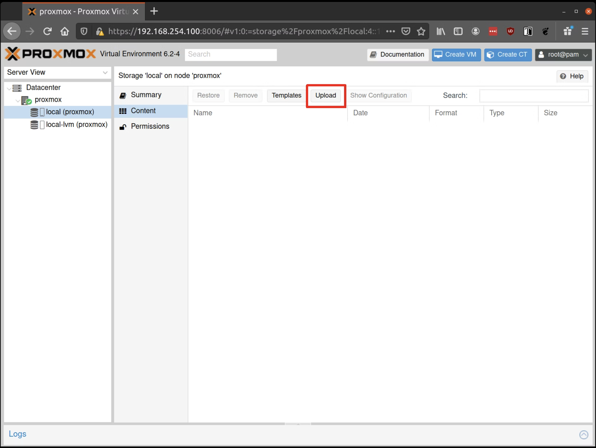
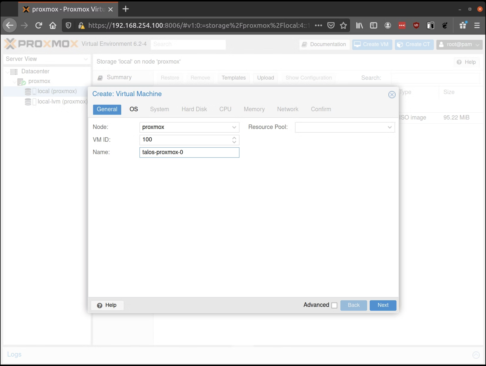
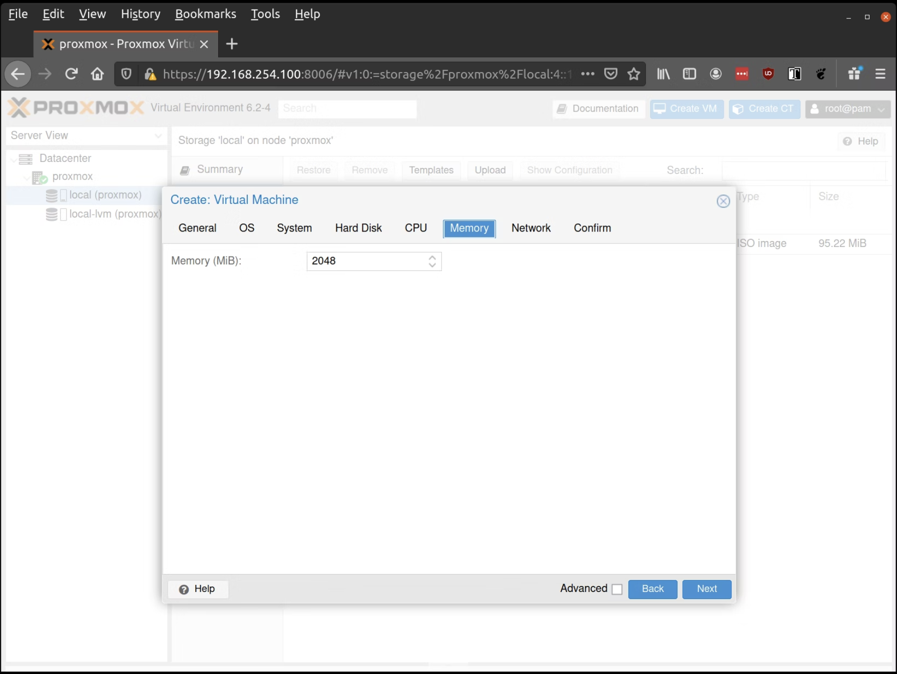

So it begins again...I have started my homelab again, instead of going bare metal. I am moving to [Proxmox]() mainly to cut down on the machines as well as experience a HyperVisor. I have used Proxmox before but this time, I am going to try and get it as close to production as I can.

I will be running three [Beelink EQi13 Pro Mini PC, Intel Core i5 13500H 12C/16T](https://www.bee-link.com/products/beelink-eqi13-pro). As a high availability Proxmox cluster running Ceph, the main use will be running a HA [Talos](https://www.talos.dev/) cluster across 3 control plane nodes, and 3 worker nodes. Amongst other microservices. Each unit will be upgraded to 64GB over time. This would give me the following compute:

```txt
36C/48T - 192GB ram - 2TB
```

I'll be running a 1TB boot drive as well as a 1TB storage drive, mainly for the Talos workers. As my other services can use the host boot drive. Plenty of space left on there once Proxmox is installed. Ill be running my cluster with a `2:1` ratio giving me `96vCPU` which is plenty, the ram might end up being a bottle neck but I doubt it.

## Getting started

As we're going to be installing Talos we will need to be using their CLI. As I am on [Omarchy](https://omarchy.org/) I can't use HomeBrew which is one of their recommended methods instead we can use their provided script

```bash
curl -sL https://talos.dev/install | sh
```

## Building the ISO

Once installed you will have access to `talosctl`. Now you have the Talos CLI it's time to generate the ISO. As we're going to be using Proxmox we will need the QEMU guest support, as well as two other add ons. Ill be running Longhorn as my storage so we need to add the following also:

```
- siderolabs/qemu-guest-agent
- siderolabs/iscsi-tools
- siderolabs/util-linux-tools
```

To build the ISO we need to head over to [https://factory.talos.dev/](https://factory.talos.dev/) where you should select the following options:

```
1. Cloud Server
2. Choose the latest version of Talos
3. Nocloud
4. Pick the arch you need, as we're using Proxmox it's amd64
5. Add the extentions from above
6. Follow the defaults through to the final page
```

Once you have completed those steps, you're able to download your ISO but also keep this page safe as you will need it later.

## Creating the VMs

We have `talosctl` installed, got our ISO now we can create our virtual machines.

### Upload the ISO

First step is to upload the ISO From the Proxmox UI, select the “local” storage and enter the “Content” section. Click the “Upload” button:



Select the ISO you downloaded previously, then hit “Upload”

### Creating the VM

First we need to create our control plane, for this I have given it 4vCPU / 8GB RAM and 250GB storage.


Fill out a name for the new VM, example being: `talos-proxmox-0`



In the OS tab, select the ISO we uploaded earlier:


Keep the defaults set in the “System” tab. Keep the defaults in the “Hard Disk” tab as well, only changing the size if desired. Next Verify that the RAM is set to at least 2GB:



Keep the default values for networking, verifying that the VM is set to come up on the bridge interface. Finish creating the VM by clicking through the “Confirm” tab and then “Finish”. Repeat this process for a second VM to use as a worker node. You can also repeat this for additional nodes desired.

## Start Control Plane Node

Once the VMs have been created and updated, start the VM that will be the first control plane node. This VM will boot the ISO image specified earlier and enter “maintenance mode”. Once the machine has entered maintenance mode, there will be a console log that details the IP address that the node received. Take note of this IP address.

Before we start creating config files. export the control planes IP so we can use it through out our session.

```bash
export CONTROL_PLANE_IP=1.2.3.4
```

## Generate Machine Configurations

With the IP address above, you can now generate the machine configurations to use for installing Talos and Kubernetes. Remember I advised on saving the info you got after you built the image from the image factory well this is where it comes in handy.

The following snippet `factory.talos.dev/installer/ce4c980550dd2ab1b17bbf2b08801c7eb59418eafe8f279833297925d67c7515:v1.11.0` will apply the extra packages when you're setting up your config files.

```bash
talosctl gen config talos-proxmox-cluster https://$CONTROL_PLANE_IP:6443 --output-dir conf --install-image factory.talos.dev/installer/ce4c980550dd2ab1b17bbf2b08801c7eb59418eafe8f279833297925d67c7515:v1.11.0
```

After you have run the above you should have a `controlplane.yaml`, `worker.yaml` and `talosconf` file. These are the files you use to edit your VMs.

## Creating your Control Plane

First we need to make some edits to our `controlplane.yaml`. First we will give it a static IP then set up the metrics server.

Under the network block you will need to uncomment the following and make these changes

```yaml
network:
  hostname: talos-cp-1
  # `interfaces` is used to define the network interface configuration.
  interfaces:
    - interface: eth0
      # Assigns static IP addresses to the interface.
      addresses:
        - 192.168.7.10/22
      # A list of routes associated with the interface.
      routes:
        - network: 0.0.0.0/0 # The route's network (destination).
          gateway: 192.168.4.1 # The route's gateway (if empty, creates link scope route).
          metric: 1024 # The optional metric for the route.
      mtu: 1500 # The interface's MTU.

  nameservers:
    - 1.1.1.1
```

Of course change these to what you need them to be, also double check your network interface too. Once the config is applied the VM will have a hostname and static IP. Next let's setup the metrics server.

### Metrics Server

Metrics Server enables use of the Horizontal Pod Autoscaler and Vertical Pod Autoscaler. It does this by gathering metrics data from the kubelets in a cluster. We need enable kubelet certificate rotation so set the following:

```yaml
machine:
  kubelet:
    extraArgs:
      rotate-server-certificates: true
```

We will want to ensure that new certificates for the kubelets are approved automatically. This can easily be done with the Kubelet Serving Certificate Approver, which is the above snippet, which will automatically approve the Certificate Signing Requests generated by the kubelets.

We can have Kubelet Serving Certificate Approver and metrics-server installed on the cluster automatically during bootstrap by adding the following snippet to the Cluster Config of the node that will be handling the bootstrap process:

```yaml
cluster:
  extraManifests:
    - https://raw.githubusercontent.com/alex1989hu/kubelet-serving-cert-approver/main/deploy/standalone-install.yaml
    - https://github.com/kubernetes-sigs/metrics-server/releases/latest/download/components.yaml
```

### Config for Longhorn

Longhorn requires pod security enforce: "privileged".
By default, Talos Linux applies a baseline pod security profile across namespaces, except for the `kube-system` namespace.

We can do one of the following:

1.

```yaml
exemptions:
  namespaces:
    - kube-system
    - longhorn-system
```

Or once you have installed Longhorn create the following namespace:

2.

```yaml
apiVersion: v1
kind: Namespace
metadata:
  name: longhorn-system
  labels:
    pod-security.kubernetes.io/enforce: privileged
    pod-security.kubernetes.io/audit: privileged
    pod-security.kubernetes.io/warn: privileged
```

Using the `controlplane.yaml` generated above, you can now apply this config using `talosctl`.

```bash
talosctl apply-config --insecure --nodes $CONTROL_PLANE_IP --file conf/controlplane.yaml
```

You should now see some action in the Proxmox console for this VM. Talos will be installed to disk, the VM will reboot, and then Talos will configure the Kubernetes control plane on this VM. The VM will remain in stage Booting until the bootstrap is completed in a later step.

## Using the Cluster

Once the cluster is available, you can make use of `talosctl` and `kubectl` to interact with the cluster. For example, to view current running containers, run `talosctl containers` for a list of containers in the system namespace, or `talosctl containers -k`` for the`k8s.i`o namespace. To view the logs of a container, use`talosctl logs <container>`or`talosctl logs -k <container>`.

First, configure `talosctl` to talk to your control plane node by issuing the following, updating paths and IPs as necessary:

```yaml
export TALOSCONFIG="_out/talosconfig"
talosctl config endpoint $CONTROL_PLANE_IP
talosctl config node $CONTROL_PLANE_IP
```

````

### Bootstrap etcd

```bash
talosctl bootstrap
````

### Generate `kubeconfig`

```bash
talosctl kubeconfig .
```

Now you're doing...follow the same steps as you did when you created the control plane for a worker node

```bash
talosctl apply-config --insecure --nodes $WORKER_IP --file conf/worker.yaml
```
