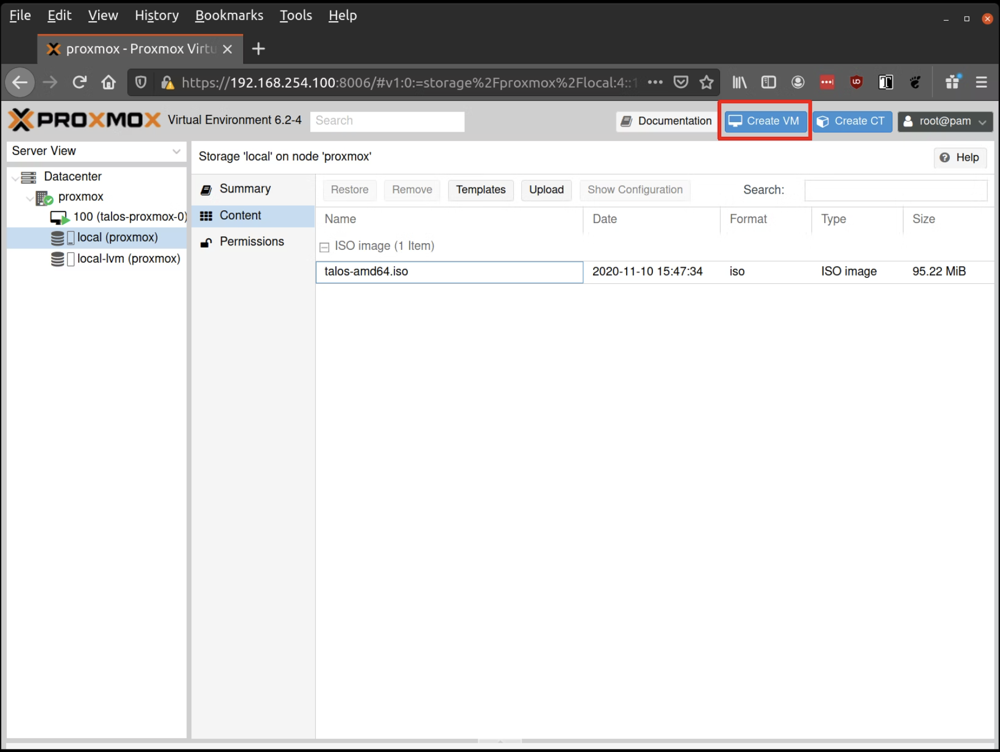

So it begins again... I have started rebuilding my homelab, but instead of going bare metal, I am moving to [Proxmox](https://www.proxmox.com/en/products/proxmox-virtual-environment/overview) mainly to reduce the number of physical machines as well as to experience working with a hypervisor. I have used Proxmox before, but this time I am going to try to get it as close to production-ready as I can.

I will be running three [Beelink EQi13 Pro Mini PC, Intel Core i5 13500H 12C/16T](https://www.bee-link.com/products/beelink-eqi13-pro) units as a high availability Proxmox cluster running Ceph. The main use will be running an HA [Talos](https://www.talos.dev/) cluster across 3 control plane nodes and 3 worker nodes, amongst other microservices. Each unit will be upgraded to 64GB of RAM over time. This would give me the following total compute resources:

```txt
36C/48T - 192GB RAM - 2TB storage
```

I'll be running a 1TB boot drive as well as a 1TB storage drive, mainly for the Talos workers, as my other services can use the host boot drive. There will be plenty of space left on the boot drive once Proxmox is installed. I'll be running my cluster with a `2:1` ratio, giving me `96vCPU`, which is plenty. The RAM might end up being a bottleneck, but I doubt it.

## Getting started

Since we're going to be installing Talos, we will need to use their CLI. As I am on [Omarchy](https://omarchy.org/), I can't use Homebrew, which is one of their recommended methods. Instead, we can use their provided script:

```bash
curl -sL https://talos.dev/install | sh
```

## Building the ISO

Once installed, you will have access to `talosctl`. Now that you have the Talos CLI, it's time to generate the ISO. Since we're going to be using Proxmox, we will need the QEMU guest support as well as two other add-ons. I'll be running Longhorn as my storage solution, so we need to add the following extensions:

```
- siderolabs/qemu-guest-agent
- siderolabs/iscsi-tools
- siderolabs/util-linux-tools
```

To build the ISO, we need to head over to [https://factory.talos.dev/](https://factory.talos.dev/) where you should select the following options:

```
1. Cloud Server
2. Choose the latest version of Talos
3. Nocloud
4. Pick the architecture you need (since we're using Proxmox, it's amd64)
5. Add the extensions from above
6. Follow the defaults through to the final page
```

Once you have completed those steps, you're able to download your ISO. Keep this page bookmarked, as you will need the information later.

## Creating the VMs

We have `talosctl` installed and our ISO ready, so now we can create our virtual machines.

### Upload the ISO

First, we need to upload the ISO. From the Proxmox UI, select the "local" storage and enter the "Content" section. Click the "Upload" button:


Select the ISO you downloaded previously, then hit "Upload".

### Creating the VM

First, we need to create our control plane. For this, I have allocated 4vCPU, 8GB RAM, and 250GB storage.



Fill out a name for the new VM, for example: `talos-proxmox-0`


In the OS tab, select the ISO we uploaded earlier:


Keep the defaults in the "System" tab and the "Hard Disk" tab, only changing the size if desired. Next, verify that the RAM is set to at least 2GB:


Keep the default values for networking, verifying that the VM is set to come up on the bridge interface. Finish creating the VM by clicking through the "Confirm" tab and then "Finish". Repeat this process for a second VM to use as a worker node. You can also repeat this for any additional nodes desired.

## Start Control Plane Node

Once the VMs have been created and updated, start the VM that will be the first control plane node. This VM will boot the ISO image specified earlier and enter "maintenance mode". Once the machine has entered maintenance mode, there will be a console log that details the IP address that the node received. Take note of this IP address.

Before we start creating config files, export the control plane's IP so we can use it throughout our session:

```bash
export CONTROL_PLANE_IP=1.2.3.4
```

## Generate Machine Configurations

With the IP address above, you can now generate the machine configurations to use for installing Talos and Kubernetes. Remember how I advised saving the information you got after building the image from the image factory? This is where it comes in handy.

The following snippet `factory.talos.dev/installer/ce4c980550dd2ab1b17bbf2b08801c7eb59418eafe8f279833297925d67c7515:v1.11.0` will apply the extra packages when you're setting up your config files.

```bash
talosctl gen config talos-proxmox-cluster https://$CONTROL_PLANE_IP:6443 --output-dir conf --install-image factory.talos.dev/installer/ce4c980550dd2ab1b17bbf2b08801c7eb59418eafe8f279833297925d67c7515:v1.11.0
```

After you have run the above command, you should have a `controlplane.yaml`, `worker.yaml`, and `talosconf` file. These are the configuration files you use to configure your VMs.

## Creating your Control Plane

First, we need to make some edits to our `controlplane.yaml`. We will give it a static IP and then set up the metrics server.

Under the network block, you will need to uncomment the following and make these changes:

```yaml
network:
  hostname: talos-cp-1
  # `interfaces` is used to define the network interface configuration.
  interfaces:
    - interface: eth0
      # Assigns static IP addresses to the interface.
      addresses:
        - 192.168.7.10/22
      # A list of routes associated with the interface.
      routes:
        - network: 0.0.0.0/0 # The route's network (destination).
          gateway: 192.168.4.1 # The route's gateway (if empty, creates link scope route).
          metric: 1024 # The optional metric for the route.
      mtu: 1500 # The interface's MTU.

  nameservers:
    - 1.1.1.1
```

Of course, change these to what you need them to be, and double-check your network interface as well. Once the config is applied, the VM will have a hostname and static IP. Next, let's set up the metrics server.

### Metrics Server

Metrics Server enables use of the Horizontal Pod Autoscaler and Vertical Pod Autoscaler. It does this by gathering metric data from the kubelets in a cluster. We need to enable kubelet certificate rotation, so set the following:

```yaml
machine:
  kubelet:
    extraArgs:
      rotate-server-certificates: true
```

We will want to ensure that new certificates for the kubelets are approved automatically. This can easily be done with the Kubelet Serving Certificate Approver, which is the above snippet that will automatically approve the Certificate Signing Requests generated by the kubelets.

We can have Kubelet Serving Certificate Approver and metrics-server installed on the cluster automatically during bootstrap by adding the following snippet to the Cluster Config of the node that will be handling the bootstrap process:

```yaml
cluster:
  extraManifests:
    - https://raw.githubusercontent.com/alex1989hu/kubelet-serving-cert-approver/main/deploy/standalone-install.yaml
    - https://github.com/kubernetes-sigs/metrics-server/releases/latest/download/components.yaml
```

### Config for Longhorn

Longhorn requires pod security enforce: "privileged".
By default, Talos Linux applies a baseline pod security profile across namespaces, except for the `kube-system` namespace.

We can do one of the following:

1. Add the exemption to the cluster config:

```yaml
exemptions:
  namespaces:
    - kube-system
    - longhorn-system
```

Or, once you have installed Longhorn, create the following namespace:

2. Create a privileged namespace:

```yaml
apiVersion: v1
kind: Namespace
metadata:
  name: longhorn-system
  labels:
    pod-security.kubernetes.io/enforce: privileged
    pod-security.kubernetes.io/audit: privileged
    pod-security.kubernetes.io/warn: privileged
```

Using the `controlplane.yaml` generated above, you can now apply this config using `talosctl`:

```bash
talosctl apply-config --insecure --nodes $CONTROL_PLANE_IP --file conf/controlplane.yaml
```

You should now see activity in the Proxmox console for this VM. Talos will be installed to disk, the VM will reboot, and then Talos will configure the Kubernetes control plane on this VM. The VM will remain in the "Booting" stage until the bootstrap is completed in a later step.

## Using the Cluster

Once the cluster is available, you can make use of `talosctl` and `kubectl` to interact with the cluster. For example, to view current running containers, run `talosctl containers` for a list of containers in the system namespace, or `talosctl containers -k` for the `k8s.io` namespace. To view the logs of a container, use `talosctl logs <container>` or `talosctl logs -k <container>`.

First, configure `talosctl` to talk to your control plane node by issuing the following, updating paths and IPs as necessary:

```bash
export TALOSCONFIG="_out/talosconfig"
talosctl config endpoint $CONTROL_PLANE_IP
talosctl config node $CONTROL_PLANE_IP
```

### Bootstrap etcd

```bash
talosctl bootstrap
```

### Generate `kubeconfig`

```bash
talosctl kubeconfig .
```

Now you're ready to go! Follow the same steps as you did when you created the control plane for a worker node:

```bash
talosctl apply-config --insecure --nodes $WORKER_IP --file conf/worker.yaml
```
